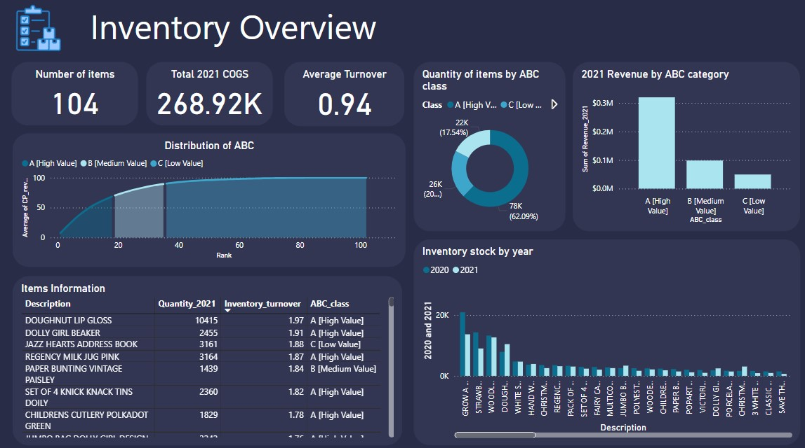
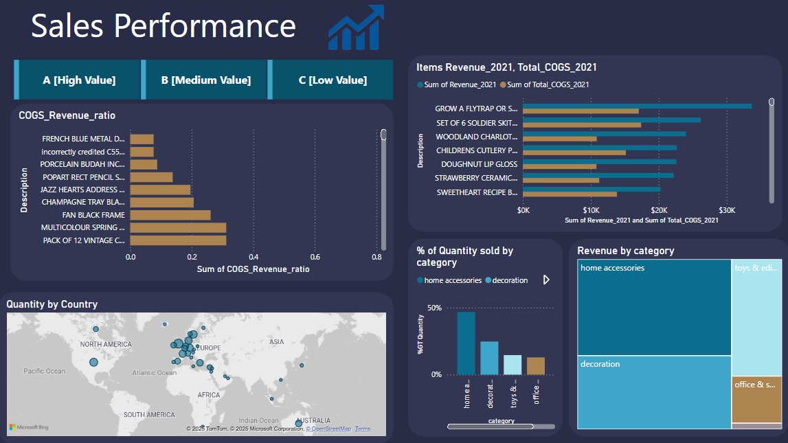
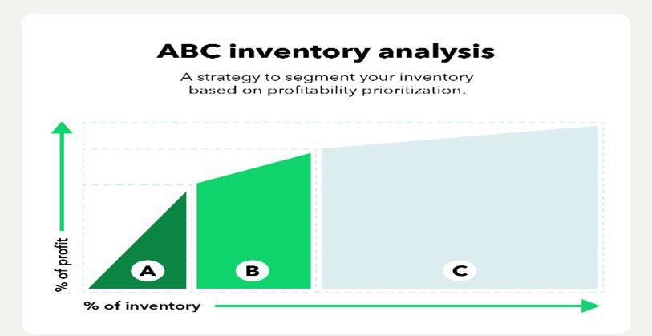

# **Inventory Analysis Project**

Analyze a dataset from a fictitious company named WarmeHands Inc. As with many retailers, they want to investigate possible improvements in inventory management and purchases,

Start using some Power Query for cleaning and exploring the data to verify everything makes sense. Next, work with some manipulations and intermediate DAX formulas for analyzing the clean information to obtain focused insights. Finally, finish by creating some attractive yet informative report pages.

  
**Inventory analysis** is the process of examining inventory to determine the optimum amount a business should carry. By obtaining a clear picture of the inventory that keeps your company profitable, you can keep up with customer demand while increasing sales and controlling costs.

**ABC analysis**

ABC analysis brings simplicity to inventory analysis by putting all of your inventory into three buckets, enabling you to make more strategic decisions. The buckets are:

- **Category A**: Top 70–80% of the total revenue, representing the most valuable items.
- **Category B**: Items that contribute around 15–25% of the total revenue.
- **Category C**: Items that account for the remaining 5–10% of revenue, typically lower-priority items.

**Inventory turnover rate**

Your inventory turnover rate shows you how effectively you’re managing inventory. It measures how many times your average inventory is sold during a certain period.

This inventory formula is calculated by dividing the cost of goods sold by the average inventory for a certain period.

**Project Goal**

my goal was to help guide purchasing decisions for better stock management.

I used the ABC classification and the COGS to Revenue ratio to identify patterns that can improve profitability and optimize inventory.

**Key highlights**

1. Items with a low COGS to Revenue ratio are more profitable because they cost less compared to their selling prices. For example, the WOODLAND CHARLOTTE BAG stood out as a top performer. Increasing its stock would likely boost profits.
2. Category A items generate around 70% of total revenue. Among these, Doughnut lip gloss had the highest inventory turnover and increased significantly in sales from 2020 to 2021, making it another great candidate for restocking.
3. Jewelry Absence: The Jewelry category was not present in either medium or high-value tiers, suggesting limited profitability. This category should be reconsidered for optimization or reallocation.
4. Victorian Metal Postcard Spring: Despite modest revenue, this item had a high inventory turnover (1.74), indicating strong sales efficiency with limited stock. Increasing inventory for high-turnover items like this may boost revenue.
5. Denmark: The top European country ordering the Victorian Metal Postcard Spring, highlighting potential geographic growth opportunities.